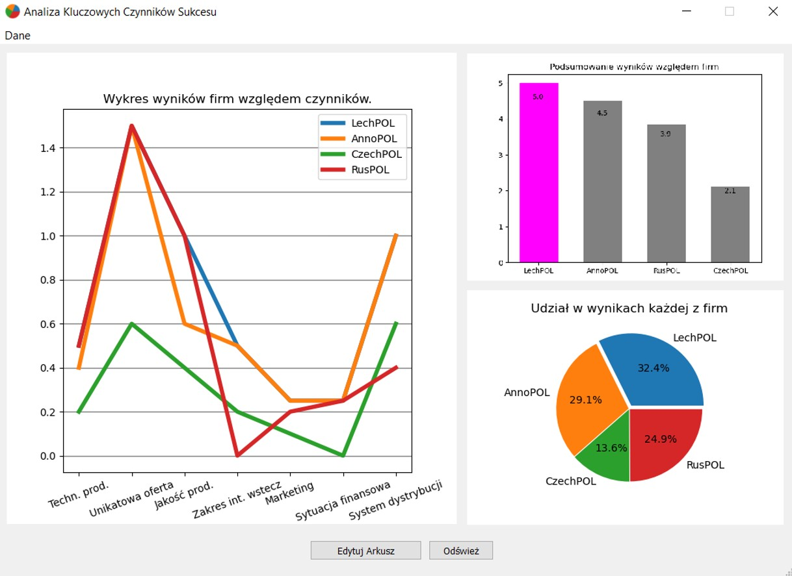
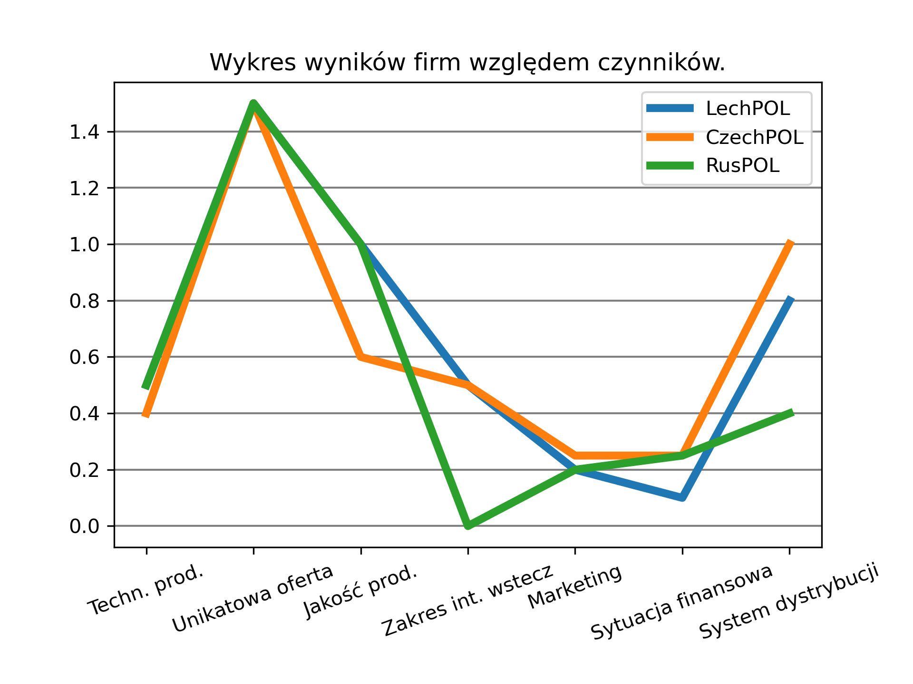
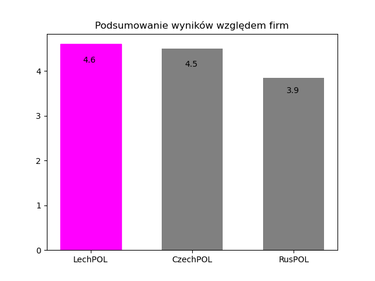
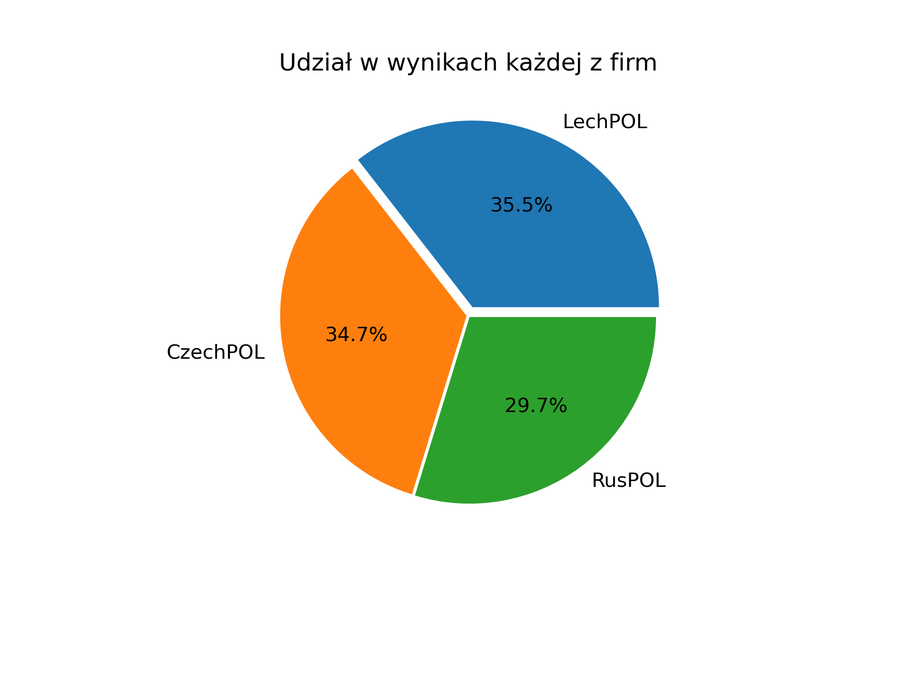

# Critical Success Factor Analisys 

Program helping with CSF analisys, creates an excel workbook, with a template, helping with beginning the analisys. After data input, and clicking "Odśwież" button, program generates 3 figures representing the data with necessary information enabling operator to better interpret it. 

---

---

The figures are as follows:
- The main plot - representing factors of every company
  

- The bar chart - representing the overall result of every company (ranking)

- The pie chart - representing the share of the sum of results of every company

